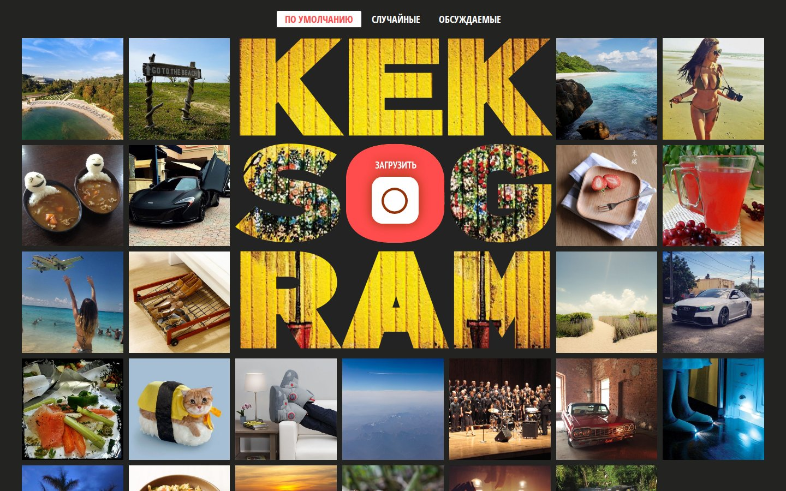

# Kekstagram

A photo feed with an upload form, where you can put an effect on a picture and add hashtags
before posting it. Plain JavaScript modules, built with Vite.

This is a training project, the first of three I built at HTML Academy in 2024. I wrote it from
February to April 2024 on the course
[JavaScript. Professional web interface development](https://htmlacademy.ru/intensive/javascript),
and mentor [Arthur Litovko](https://htmlacademy.ru/profile/id6927) reviewed the pull requests.
The markup and styles came with the task. The reviewed original
lives in [htmlacademy-javascript/2483435-kekstagram-31](https://github.com/htmlacademy-javascript/2483435-kekstagram-31).

[Live demo](https://htmlacademy-javascript.github.io/2483435-kekstagram-31/16/) · [How it works](#how-it-works) · [Run locally](#run-locally)

The demo is the academy build of pull request #16. The last review fixes (#18 and #19) are in
this repository but not in that build.

## What you can do

Scroll through 25 photos from the academy server and open any of them full size with its likes
and comments. Comments show up five at a time. Switch the feed between the default order, 10
random photos and the most discussed ones. Pick a `.jpg`, `.jpeg` or `.png` from your disk to open
the editor: zoom it from 25% to 100%, apply one of five effects with a slider, write up to five
hashtags and a caption of up to 140 characters, then send it to the server.

## How it works

### Loading and filters

`js/main.js` fetches the photos once through `js/utils/api.js`, keeps them in memory and renders
the thumbnails from a `<template>`. The filter buttons only appear after the data arrives. Each
filter is a plain function in `js/filters/filter-options.js` that returns a new array with
`toSorted`, and the redraw goes through a 500 ms debounce, so fast clicking doesn't rebuild the
grid on every click.

### Full-size photo and comments

The big photo reuses one modal. `js/show-big-photo/comments.js` keeps the full comment list and
appends the next slice of five on every click of the loader button. The first five are rendered
by calling that same click handler, so there is one code path for both cases.

### Upload form

The editor is one `<form>`. Closing it calls `form.reset()`, and the `reset` listener in
`js/upload-new-photo/loading-module.js` puts the slider, the scale and the validation back.
Effects live in a table in `js/upload-new-photo/effects.js`: each entry has slider options for
noUiSlider and a function that turns the value into a CSS `filter`. Adding an effect means one
more entry.

Hashtags are checked with Pristine. `form-validation.js` splits the field on spaces before `#`,
then checks count, duplicates, the leading `#`, length and allowed characters, and remembers the
first error so Pristine can show it. The submit button is blocked while the request is in flight.

## Run locally

```bash
git clone https://github.com/murpiano/_kekstagram.git
cd _kekstagram
npm install

npm start         # Vite dev server
npm run lint      # ESLint with the academy config
npm run build     # production build into dist/
npm run preview   # serve the build
```

`package.json` asks for Node 18 and npm 9. The project also builds on Node 24.

There are no tests. In the academy repository `.github/workflows/check.yml` ran the linter on
every pull request. Photos and uploads go to `https://31.javascript.htmlacademy.pro/kekstagram`.

## Where things live

```text
js/
├── main.js               loads the photos and starts everything
├── thumbnails.js         renders the grid
├── filters/              filter buttons and sort functions
├── show-big-photo/       full-size modal and comments
├── upload-new-photo/     editor, effects, validation, sending
└── utils/                API calls, debounce, modal helpers
```

One folder per screen feature. Markup, styles and images come from the academy and sit in
`index.html`, `css/` and `img/`.

## Rough edges

- The editor opens for any file. `parsePhoto` returns `false` for other extensions, but
  `loading-module.js` ignores it and shows the previous preview.
- After the form closes, `resetScale` removes the transform, but `currentScale` in
  `photo-editing.js` keeps the old value. The next zoom click starts from there.
- There is no file size limit on uploads.
- Everything depends on the academy server. If it goes down, the feed stays empty and an error
  banner shows for five seconds.

---

<sub>[Bogdan Trotsenko](https://github.com/murpiano) · [murpiano](https://github.com/murpiano) · [Telegram](https://t.me/murpiano)</sub>
